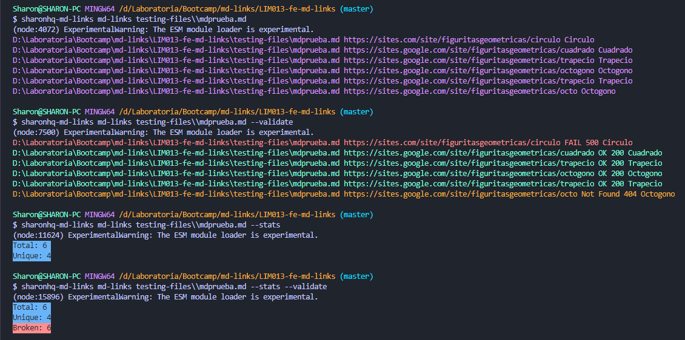
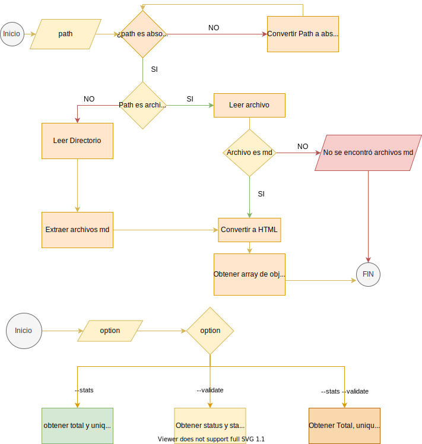
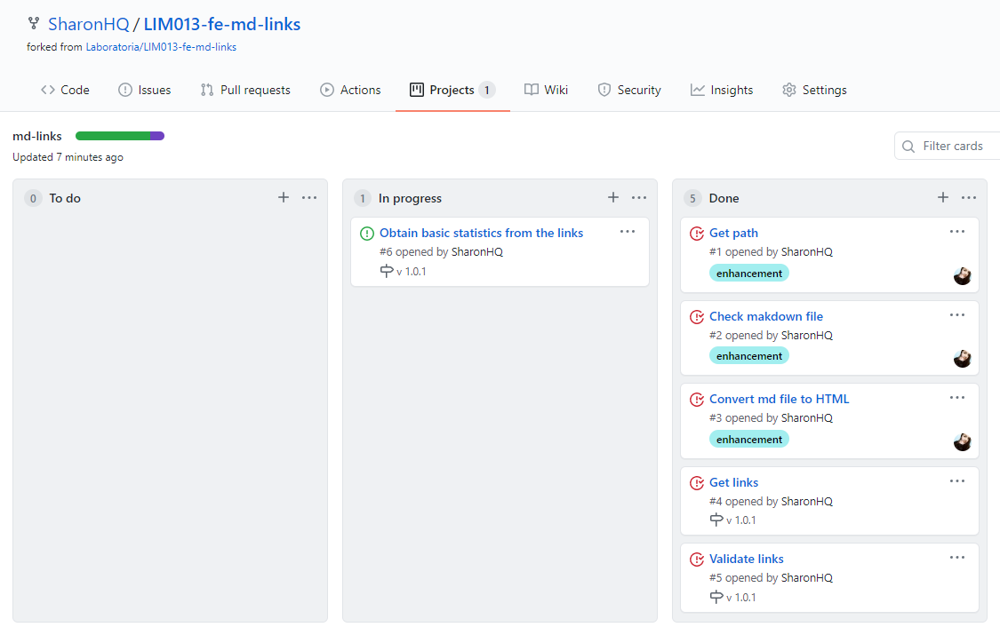

<br />
<p align="center">
  <a href="https://github.com/SharonHQ/LIM013-fe-md-links/blob/master/README.md">
    
  </a>
  <h1 align="center">&#60SharonHQ&#62/md-links</h1>
</p>

## Table of Contents

* [About the Project](#about-the-project)
* [Flowchart](#flowchart)
* [Implementation Board ](#implementation-board)
* [Getting Started](#getting-started)
  * [Prerequisites](#prerequisites)
  * [Installation](#installation)
* [Usage](#usage)
* [Contact](#contact)

## About The Project



This module extracts all the links that are in a markdown file, it has two options: 

1. --validate: Check if there are valid or broken links
2. --stats: Shows a statistic of the total number of links and how many of them are unique.
3. --validate --stats: Adds to the statistics the total amount of broken links.

## Flowchart


## Implementation Board


## Getting Started

### Installation

1. Install NPM packages
```sh
npm i sharonhq
```

## Usage

We will use the *md-links* command to get the links of the path.
```sh
sharonhq md-links <path>
```
* ### **--validate**
```sh
sharonhq md-links <path> --validate
```
* ### **--stats**
```sh
sharonhq md-links <path> --stats
```
* ### **--validate --stats**
```sh
sharonhq md-links <path> --validate --stats
```

## Contact

[Sharon](https://github.com/SharonHQ)

Project Link: [https://github.com/SharonHQ/LIM013-fe-md-links](https://github.com/SharonHQ/LIM013-fe-md-linkse)
